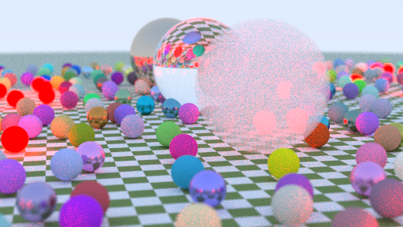

# raytrace_rs_dev
[Ray Tracing in One Weekend](https://raytracing.github.io/books/RayTracingInOneWeekend.html) in Rust.
this is prototype for study.

# installation
install [rustup](https://www.rust-lang.org/ja/tools/install).

and execute on root folder.
```cargo run --release```

# result
after processes completion, a PPM image is generated on `./products/` like this.
